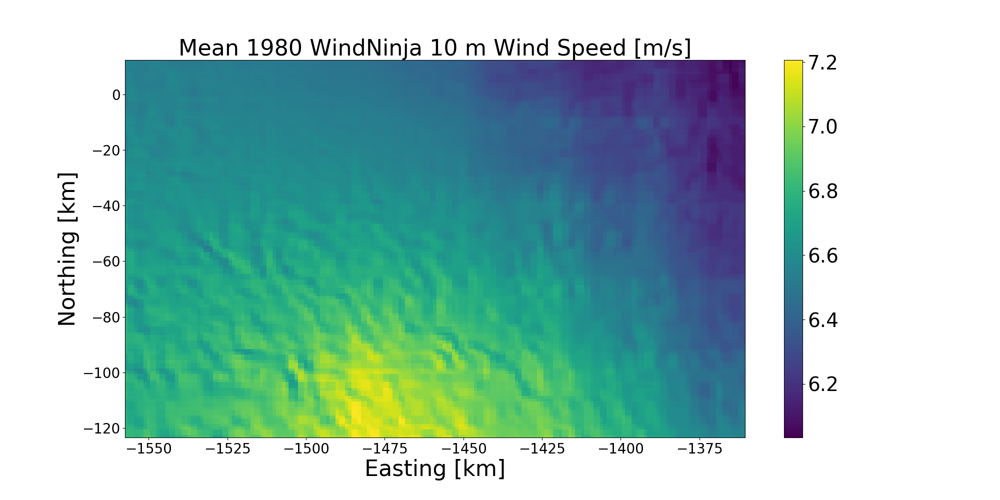

# antarctic-windninja
Workflow to dynamically downscale wind speed and direction over Antarctica using the [WindNinja](https://github.com/firelab/windninja) model. 


## Example usage
This worfklow currently supports one spatial domain over Pine Island Glacier (PIG) in West Antarctica. 

First, edit job settings in `PIG/job.sbatch`. 

Then, execute dynamic downscalling with `WindNinja`: 
```bash
cd PIG
sbatch job.sbatch
```
## Compute environment
`WindNinja` has a relatively complex chain of dependencies. For this reason, I have exploited containerization technologies including `Docker` and `Singularity`. 

If you would like to use my existing `ubuntu-windninja` `Docker` container, you can pull it from Docker Hub and build it on summit:
```bash
# Switch to a compile node and activate Singularity module
ssh scompile
cache_dir=/scratch/summit/erke2265/ # Update this to your desired directory.
cd ${cache_dir}
ml singularity/3.6.4

# Set singularity cache directories and settings 
SINGULARITY_LOCALCACHEDIR=${cache_dir}
SINGULARITY_CACHEDIR=${cache_dir}
SINGULARITY_TMPDIR=${cache_dir}
export SINGULARITY_LOCALCACHEDIR
export SINGULARITY_CACHEDIR
export SINGULARITY_TMPDIR

# Pull image from Docker Hub and activate
singularity pull docker://ekeenan/ubuntu-windninja
singularity run -B ${cache_dir}:${cache_dir} ubuntu-windninja_latest.sif
```

Alternatively, if you would like to build your own Docker container, you can mimic my workflow:
```bash
# Clone repository and build docker image
git clone https://github.com/firelab/windninja.git 
cd windninja 
docker build -t windninja .

# Enter image on the command line (you will need to modify the tag)
docker exec -it ef5a408d440fce5dfe361d865fca754b6d284eaec1706675d010a3293586788b /bin/sh

# Install third-party libraries
apt-get install sudo
sudo apt-get install cmake-curses-gui
cd ../scripts 
./build_deps.sh

# Install (check WindNinja repository for detailed installation instructions) 
mkdir /opt/src/build
cd /opt/src/build
ccmake ../windninja
make && sudo make install
sudo ldconfig
export WINDNINJA_DATA=/opt/src/windninja/data

# Run example 
cd /opt/src/windninja
/opt/src/usr/bin/WindNinja_cli --num_threads 4 data/cli_domainAverage.cfg

# Send docker image from local machine to docker hub 
docker ps -a
docker commit c93a2e0ef80c ubuntu-windninja # The tag is the container's id
docker tag 768516e547e4 ekeenan/ubuntu-windninja # The tag is the image's id
docker push ekeenan/ubuntu-windninja
```
